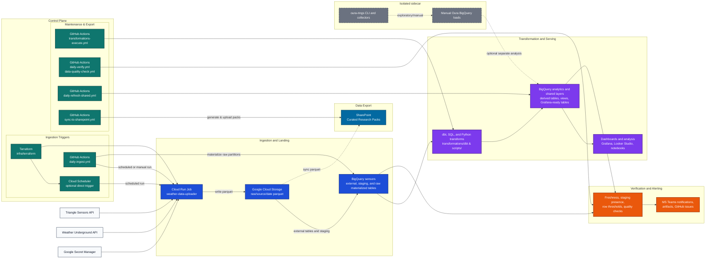

# Durham Environmental Monitoring - Architecture Overview

This document is the evergreen system overview for the project. It explains how data moves through the platform, which components own each stage, and where to look for operational procedures.

For step-by-step setup, backfills, refreshes, and verification commands, use [OPERATIONS_RUNBOOK.md](OPERATIONS_RUNBOOK.md).

## System Architecture

### System Map

The diagram below shows the control plane, ingestion path, warehouse layers, data export, downstream dashboards, and the isolated Oura utility path.

## Core Data Flow

1. GitHub Actions or Cloud Scheduler triggers the Cloud Run job `weather-data-uploader`.
2. The collector fetches TSI and WU data and writes Parquet files to Google Cloud Storage.
3. External and staging tables are materialized into native BigQuery raw tables.
4. Transformation jobs (primarily SQL via Python runners, with dbt validation scaffolding) build analytics-ready tables and views in BigQuery.
5. Shared BigQuery objects are refreshed for Grafana and related downstream consumers.
6. A workflow-driven export process packages data into research packs and syncs them to SharePoint.
7. Verification workflows check freshness, row thresholds, and data quality; failures trigger MS Teams notifications and GitHub issues.

## Key Components

### 1\. Orchestration and Control Plane

Primary workflows:

- [`.github/workflows/daily-ingest.yml`](../.github/workflows/daily-ingest.yml) triggers Cloud Run ingestion every 6 hours and can optionally redeploy, materialize, merge, and run checks.
- [`.github/workflows/transformations-execute.yml`](../.github/workflows/transformations-execute.yml) runs the data transformation layer.
- [`.github/workflows/sync-to-sharepoint.yml`](../.github/workflows/sync-to-sharepoint.yml) handles manual exports to external researchers.
- [`.github/workflows/daily-verify.yml`](../.github/workflows/daily-verify.yml) and [`.github/workflows/data-quality-check.yml`](../.github/workflows/data-quality-check.yml) validate the pipeline.
- [`.github/workflows/daily-refresh-shared.yml`](../.github/workflows/daily-refresh-shared.yml) refreshes Grafana-facing shared tables.

Terraform under `infra/terraform` owns the long-lived cloud infrastructure. Cloud Scheduler remains an optional direct production trigger when GitHub Actions is not the preferred scheduler.

### 2\. Cloud Run Ingestion Job

The ingestion job runs the collector for one day or a supplied date range.

- Job name: `weather-data-uploader`
- Region: `us-east1`
- Collector entry point: [`src/data_collection/daily_data_collector.py`](../src/data_collection/daily_data_collector.py)
- Cloud Run execution wrapper: [`scripts/run_cr_job.sh`](../scripts/run_cr_job.sh)
- GCS writer and schema coercion: [`src/storage/gcs_uploader.py`](../src/storage/gcs_uploader.py)

The collector fetches source data, writes Parquet to GCS, and feeds the downstream raw-materialization process.

### 3\. Storage and Warehouse Layers

#### Raw landing in GCS

- Bucket pattern: `gs://<bucket>/raw/...`
- Layout: `raw/source=<SOURCE>/agg=raw/dt=<YYYY-MM-DD>/`
- Format: Parquet

GCS is the durable landing zone for raw ingested files and the source for BigQuery external or staging loads, as well as the source for SharePoint exports.

#### BigQuery production dataset: `sensors`

The `sensors` dataset contains the core warehouse objects:

- external and staging tables used during load and recovery flows
- native partitioned raw tables such as `tsi_raw_materialized` and `wu_raw_materialized`
- enriched and transformed analytics tables used for analysis and sharing

Key materialization script:

- [`scripts/materialize_partitions.py`](../scripts/materialize_partitions.py)

#### BigQuery shared dataset: `sensors_shared`

The `sensors_shared` dataset exposes dashboard-friendly objects and copied or refreshed tables for downstream tools such as Grafana.

Key refresh scripts:

- [`scripts/refresh_tsi_shared.sh`](../scripts/refresh_tsi_shared.sh)
- [`scripts/refresh_wu_shared.sh`](../scripts/refresh_wu_shared.sh)
- [`scripts/sync_to_grafana.py`](../scripts/sync_to_grafana.py)

### 4\. Transformation Layer

Transformations render and execute logic over the warehouse to produce analytics-ready tables.

- primary production runner: SQL via [`scripts/run_transformations.py`](../scripts/run_transformations.py)
- validation/migration path: dbt scaffold in `transformations/dbt/`
- batch wrapper: [`scripts/run_transformations_batch.sh`](../scripts/run_transformations_batch.sh)

This layer separates ingestion concerns from reporting and analysis concerns.

### 5\. Data Export (SharePoint)

To support external researchers, the pipeline packages curated parquet files and syncs them to Microsoft SharePoint.

- Sync scripts: [`scripts/sync_parquet_to_sharepoint.py`](../scripts/sync_parquet_to_sharepoint.py) and [`scripts/upload_research_pack_to_sharepoint.py`](../scripts/upload_research_pack_to_sharepoint.py)
- Configuration: [`config/sharepoint_sync_scope.json`](../config/sharepoint_sync_scope.json)

### 6\. Verification and Alerting

Verification is handled by scheduled workflows and scripts that check whether expected data arrived and whether derived tables remain healthy.

Representative checks:

- freshness
- staging-table presence
- row-count thresholds
- transformation output validation
- data-quality assertions

Representative scripts:

- [`scripts/check_freshness.py`](../scripts/check_freshness.py)
- [`scripts/notify_teams.py`](../scripts/notify_teams.py) (MS Teams integration for alerts)
- [`scripts/check_data_quality.py`](../scripts/check_data_quality.py)
- [`scripts/verify_cloud_pipeline.py`](../scripts/verify_cloud_pipeline.py)

### 7\. Dashboard and Analytics Consumers

The primary consumer pattern is:

- BigQuery `sensors_shared` dataset
- Grafana dashboards using BigQuery queries shaped as `time`, `metric`, and `value`
- additional consumers such as Looker Studio, notebooks, and ad hoc BigQuery analysis

See [GRAFANA_SETUP.md](GRAFANA_SETUP.md) and [DATA_QUICK_START.md](DATA_QUICK_START.md) for consumer-facing guidance.

### 8\. Oura Sidecar

The `oura-rings/` directory is intentionally separate from the core production pipeline. It supports manual or exploratory collection and optional analysis, but it is not part of the default scheduled ingestion path.

## Design Notes

- The architecture keeps raw ingestion, warehouse materialization, transformations, dashboard serving, exports, and verification as separate concerns.
- Shared dashboard tables exist to isolate consumers from production-schema churn.
- Operational details such as backfill windows, row counts, and current freshness are intentionally kept out of this document because they go stale quickly.

## Related Docs

- [OPERATIONS_RUNBOOK.md](OPERATIONS_RUNBOOK.md) - reproducible procedures for setup, ingestion, backfill, refresh, and verification
- [GRAFANA_SETUP.md](GRAFANA_SETUP.md) - Grafana data source setup and example queries
- [DATA_QUICK_START.md](DATA_QUICK_START.md) - query-first guide for common analyses
- [DAILY_AUTOMATION.md](DAILY_AUTOMATION.md) - scheduler-specific automation notes
- [Monitoring-Alerts.md](Monitoring-Alerts.md) - monitoring and alerting references
- [SHAREPOINT_SYNC.md](SHAREPOINT_SYNC.md) - details on the external researcher export process
